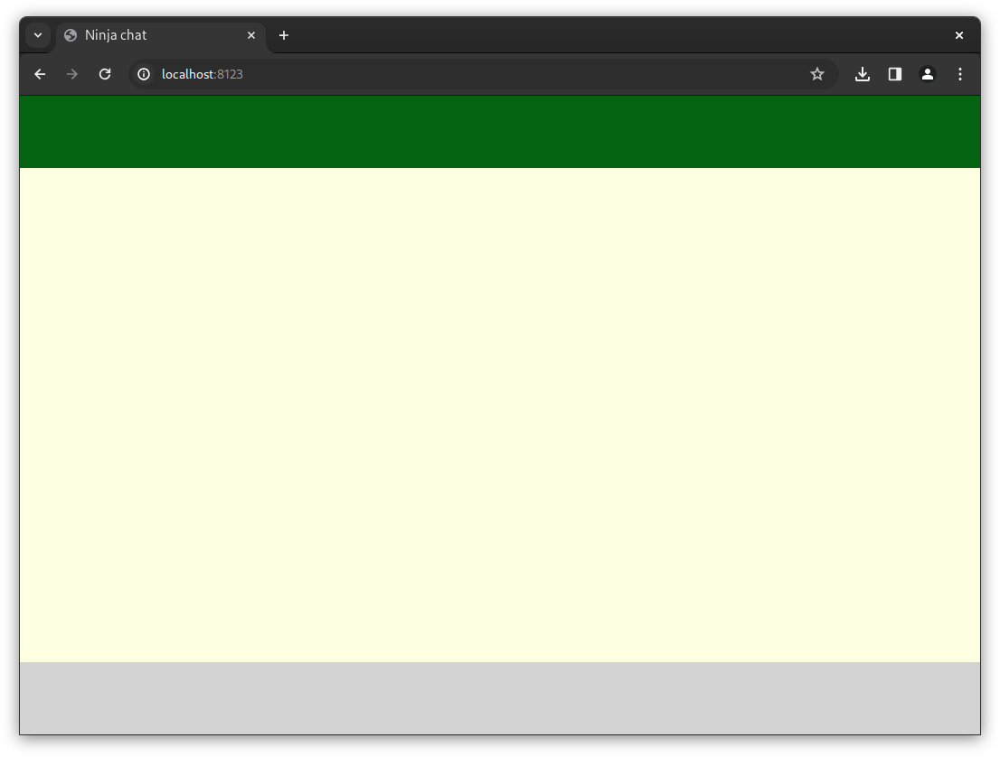
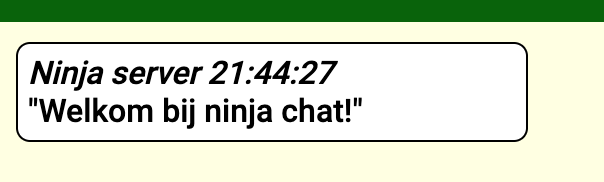
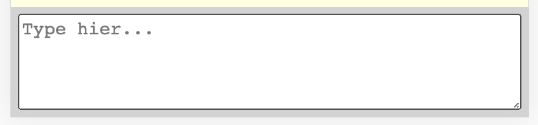
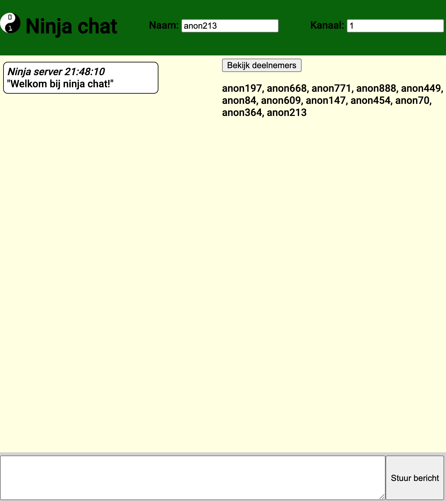

We maken een chat waarmee je berichten kunt sturen naar andere ninja's. Eerst laat je de chat werken. Daarna geef je hem je eigen uiterlijk en gedrag.

<!--more-->

## Benodigdheden

Je hebt een webbrowser en Visual Studio Code nodig. Daarmee kun je de chat op je eigen computer bouwen en uitproberen.

### Visual Studio Code



### Bestanden om mee te beginnen

Download [de startbestanden](client.zip) en pak het ZIP-bestand uit in een eigen map, bijvoorbeeld `ninja-chat` op je bureaublad. In die map staan vier bestanden:

- `index.html`: de onderdelen van de chat. Dit bestand verander je in het hoofdstuk HTML.
- `basic-chat.css`: de kleuren en vormen. Dit bestand verander je in het hoofdstuk CSS.
- `basic-chat.js`: wat er gebeurt als je typt of op een knop klikt. Dit bestand verander je in het hoofdstuk JavaScript.
- `coderdojo.png`: een plaatje dat je in de chat kunt gebruiken.

Open Visual Studio Code. Kies **Bestand → Map openen** (of **File → Open Folder**) en selecteer de map waarin je de vier bestanden hebt uitgepakt. Links in VS Code zie je nu de bestanden. Als je ergens een foutje maakt, kun je een bestand opnieuw uit het ZIP-bestand halen. Bewaar eerst een kopie als je je eigen werk wilt houden.

### Een webbrowser

Wij gebruiken [Google Chrome](https://www.google.com/chrome/) in de voorbeelden. Firefox of Edge kan ook. Open de uitgepakte map op je computer en dubbelklik op `index.html`. Je ziet nu drie gekleurde balken in je browser.

Je werkt steeds op dezelfde manier: verander een bestand in VS Code, sla het op met **Ctrl+S** (op een Mac **Cmd+S**) en ververs de pagina in je browser. Zo zie je jouw verandering. Lukt het openen van `index.html` niet? Vraag een mentor om mee te kijken.

## Structuur (HTML)

Deze instructie heeft drie hoofdstukken. Daarna kun je extra uitdagingen proberen:

1. Structuur (HTML) - hier gaan we de app onderdelen in elkaar zetten.
2. Stijl (CSS) - hier gaan we veranderen hoe de onderdelen eruit zien.
3. Scripts (JavaScript) - hier gaan we veranderen hoe de app werkt.

Bij elk hoofdstuk hoort een bestand. Voor dit hoofdstuk werken we in de *index.html*.

### HTML: blokjes en tekst

Open `index.html` in VS Code. In `<body>` staat een groot blok `container` met daarin drie kleinere blokken: `boven`, `midden` en `onder`. Je ziet ze als de groene, gele en grijze balk in de browser.

#### Stap 1: tekst in het midden

Zoek `
` en zet er tekst tussen de begin- en eindregel:



    Hallo wereld!



Sla `index.html` op en ververs de browser. Zie je **Hallo wereld!** in de gele balk?

#### Stap 2: tekst bovenaan

Zoek `
` en voeg daar tekst toe:



    Mijn ninja-chat



Sla op en ververs. Staat **Mijn ninja-chat** in de groene balk? De tekst uit stap 1 moet ook nog zichtbaar zijn.

#### Stap 3: tekst onderaan

Zoek `
` en zet daar tekst in:



    Hier komen straks de knoppen.



Sla op en ververs. Zie je nu tekst in alle drie de balken?

#### Stap 4: een blok in een blok

Vervang het middelste blok door deze versie. Laat `Hallo wereld!` staan en voeg een kleiner blok toe:



    Hallo wereld!
    
Welkom bij mijn chat!



Sla op en ververs. Zie je **Welkom bij mijn chat!** naast **Hallo wereld!** in de gele balk? `
` begint een blok en `
` sluit het af. Het blok `welkom` staat *in* het blok `midden`. Met `class="welkom"` geef je dit oefenblok een naam. Straks gebruiken we andere classnamen om de chat te laten werken en op te maken.

### Chat berichten

De tekst uit de eerste vier stappen was om te oefenen. Vervang nu het **hele** blok `midden`, inclusief de oefenteksten, door:



    



Sla `index.html` op en ververs de pagina. Zie je een welkomstbericht in de gele balk? Het lege blok `berichten` wordt door `basic-chat.js` gevuld zodra de chat verbinding heeft.

Zie je na een paar seconden geen bericht? Controleer of je internet hebt, of je `index.html` uit de uitgepakte map hebt geopend en of alle vier de bestanden samen in die map staan. Vraag een mentor om mee te kijken als het dan nog niet werkt. Ga pas verder als je het welkomstbericht ziet.

#### Berichten typen

We willen natuurlijk ook berichten kunnen sturen.  
Zet deze regel **in** het blok `onder`, boven de laatste `
`:



Type hier...



Sla `index.html` op en ververs de pagina. Je ziet *"Type hier..."*, maar als je erop klikt, kun je nog niet typen. Een `div` is geen tekstvak. Verwijder ook de oefentekst `Hier komen straks de knoppen.` uit `onder` en vervang de regel met `berichtInput` door:


<textarea class="berichtInput" placeholder="Type hier..."></textarea>


Sla `index.html` op en ververs de pagina. Je kunt nu tekst typen. Druk op Enter om een bericht te versturen. Zie je jouw tekst in de gele balk?

**Je chat werkt!** Je kunt hier stoppen en later verdergaan. In de volgende stappen geef je de chat meer knoppen en een eigen uiterlijk.

### Meer onderdelen

De chat werkt al. Voeg nu drie onderdelen toe die we verderop gebruiken: een naamveld, een kanaalveld en een verzendknop. Voeg ze **één voor één** toe. Sla na elke stap `index.html` op en ververs de browser.

#### Stap 1: je naam

Zet deze regel **in** `boven`, boven de afsluitende `
`:



Naam: <input type="text" class="naamInput">



`input` maakt een invoerveld. Zie je na het verversen een naam in dat veld? Typ je eigen naam en klik daarna ergens buiten het veld. Stuur een bericht: staat jouw naam erbij?

#### Stap 2: een kanaal

Een *kanaal* is een chatruimte met een nummer. Ninja's op hetzelfde kanaal kunnen elkaars berichten lezen.

Zet deze regel **in** `boven`, direct onder het naamveld:



Kanaal: <input type="number" class="kanaalInput">



`type="number"` maakt een invoerveld voor een getal. Zie je kanaal **1**? Typ **2** en klik buiten het veld. Zie je een bericht dat je op kanaal 2 bent? Ga daarna terug naar kanaal 1 om weer met de anderen te chatten.

#### Stap 3: een verzendknop

Zet deze regel **in** `onder`, direct onder je `textarea`:


<button class="stuurBericht">Stuur bericht</button>


Sla op en ververs. Typ een bericht en klik op **Stuur bericht**. Verschijnt het bericht in de gele balk? Je kunt ook nog steeds op Enter drukken.

**Tweede mijlpaal:** je kunt berichten sturen met je eigen naam, een kanaal kiezen en de verzendknop gebruiken. In het volgende hoofdstuk geef je de chat jouw kleuren en vormen.

Wil je ook een titel en een deelnemerslijst? Die staan bij de [extra uitdagingen](#extra-uitdagingen) aan het einde.

## Stijl (CSS)

Met CSS verander je hoe de blokken eruitzien. Open `basic-chat.css` in VS Code. We veranderen steeds één regel. Sla het bestand op, ververs de browser en stuur een nieuw testbericht als je een chatbericht wilt bekijken.

### Stap 1: kleur van de middelste balk

Zoek `.midden {`. Verander daar `background-color: lightyellow;` in:


background-color: cadetblue;


Sla op en ververs. Is de middelste balk nu blauwgroen? Het berichtenvak werkt nog steeds.

### Stap 2: tekstkleur van berichten

Zoek `.bericht {`. Voeg **binnen de accolades** deze regel toe:


color: darkblue;


Sla op, ververs en stuur een bericht. Is de tekst in het witte berichtenvak donkerblauw? Een donkere kleur blijft goed leesbaar op de witte achtergrond.

### Stap 3: ruimte in en om berichten

Zoek in dezelfde `.bericht`-regels `padding: 5px;`. Verander `5px` in `20px`. Sla op, ververs en stuur een bericht. Is er meer ruimte **in** het bericht, tussen de tekst en de rand?

Verander daarna `margin: 5px;` in `margin: 15px;`. Sla weer op, ververs en stuur twee berichten. Is er nu meer ruimte **tussen** de berichten? `px` betekent pixels: kleine punten op je scherm.

### Stap 4: een andere rand

Zoek in `.bericht` de regel `border: 1px solid black;`. Vervang die door:


border: 2px dotted darkblue;


Sla op, ververs en stuur een bericht. Heeft het bericht nu een donkerblauwe stippelrand?

**Je hebt de chat vormgegeven.** Wil je meer kleuren proberen? Geef `.boven` en `.onder` een andere `background-color`. Kijk op [csscolornames.com](https://csscolornames.com/) als je een kleurnaam zoekt.

## Scripts (JavaScript)

Je chat kan inmiddels berichten versturen. In `basic-chat.js` staat *wat er gebeurt* als je op een knop klikt of een bericht ontvangt. Open dat bestand in VS Code. Je hoeft nog niet alle regels te begrijpen: we veranderen steeds een klein stukje en proberen het daarna uit.

### Een bericht aanpassen

Zoek de functie `stuurBericht()`. Een *functie* is een groep opdrachten met een naam. In deze functie staat:


var bericht = berichtInput.val()


De variabele `bericht` bewaart de tekst die je hebt getypt. Voeg **direct onder die regel** dit toe:


bericht = bericht + " 🥷"


Sla `basic-chat.js` op en ververs de pagina. Typ een bericht en verstuur het. Staat er nu een ninja achter jouw tekst? De wijziging zit in je bestand en werkt dus ook na een volgende keer verversen. Je kunt de emoji vervangen door een ander woord of symbool.

### Je eigen chatbot

Een functie kan ook reageren op een binnenkomend bericht. We testen eerst of de chat `hoi` herkent. Voeg deze functie **boven** `function begin()` toe:


function hoiDoei(bericht) {
    if (bericht.tekst.startsWith("hoi")) {
        alert("De bot zag hoi!")
    }
}


`if` betekent *als*. De functie herkent een bericht dat met `hoi` begint. Dat werkt ook als je in de vorige stap een ninja achter je bericht hebt gezet.

Zoek nu in `begin()` de regel `socket.on('krijgBericht', toonBericht)`. Zet **daaronder**:


socket.on('krijgBericht', hoiDoei)


Sla `basic-chat.js` op en ververs de pagina. Typ `hoi` in de chat. Verschijnt er een venstertje met **De bot zag hoi!**? Sluit het venstertje en probeer `Hoi` met een hoofdletter. Dan verschijnt het niet: JavaScript ziet `hoi` en `Hoi` als verschillende woorden.

#### Laat de bot antwoorden

Vervang nu **alleen** de regel met `alert(...)` in `hoiDoei` door:


socket.emit("maakBericht", "doei")


Sla op en ververs. Typ opnieuw `hoi`. Zie je een antwoord met `doei` in de chat? Verander daarna `hoi` en `doei` in woorden die je zelf kiest. Als meerdere ninja's op hetzelfde kanaal een bot hebben, kun je meerdere antwoorden krijgen.

**Je chat heeft nu ook eigen gedrag.** Alles wat je in `basic-chat.js` opslaat, werkt opnieuw na een volgende keer verversen.

## Extra uitdagingen

De chat is af. Kies hieronder wat je leuk vindt; je hoeft ze niet allemaal te doen.

### Een titel en deelnemerslijst

Wil je de bovenste balk een titel geven? Vervang dan de oefentekst `Mijn ninja-chat` **in** `boven` door:


<h1>Ninja chat</h1>


Sla `index.html` op en ververs. Zie je de titel? Met `h1` maak je een grote kop.

Om te zien wie er in jouw kanaal zit, zet je ook deze twee regels **in** `boven`:



<button class="bekijkDeelnemers">Bekijk deelnemers</button>


Sla op en ververs. Klik op **Bekijk deelnemers**. Verschijnen er namen? Klik nog eens om de lijst te verbergen. De knop en het lege blok horen bij elkaar.

### HTML in berichten

Je kunt ook HTML in een chatbericht typen. Probeer:


<strong>Hallo ninja's!</strong>


Verstuur het bericht. Is de tekst dikgedrukt? Probeer daarna:


<em>Dit is schuin.</em>


Ook een titel werkt in een bericht, bijvoorbeeld `<h1>Hallo!</h1>`. Grote of vreemde HTML kan de chat minder goed leesbaar maken. Gebruik daarom korte opmaak en vraag een mentor om hulp als de pagina er ineens vreemd uitziet.

### Een afbeelding

In de startbestanden zit `coderdojo.png`. Zet deze regel bijvoorbeeld **in** `boven`:





Sla `index.html` op en ververs. Zie je het kleine plaatje? `src` vertelt welk bestand de browser moet openen; `width` en `height` geven de grootte aan. Je kunt de afbeelding ook als bericht typen als je hem in de chat wilt laten zien.

### Meer met CSS

Kijk in `basic-chat.css` bij `.bericht`. Verander `border-radius` eens in `20px`, sla op, ververs en stuur een bericht. Zijn de hoeken ronder?

Je kunt ook een ander lettertype uitproberen. Voeg **in** `.bericht` deze regel toe:


font-family: 'Indie Flower', cursive;


Sla op, ververs en stuur een bericht. Ziet de tekst er anders uit? In `index.html` staat al een link naar dit lettertype.

Je kunt zelfs CSS in één chatbericht gebruiken:


Dit is blauw.


Verstuur het bericht. Is alleen deze tekst blauw?

### Twee kanalen verder

Wil je met één knop twee kanalen verder gaan? Voeg dan in `index.html` binnen het blokje `boven` een knop toe:


<button class="volgendKanaal">Twee kanalen verder</button>


Voeg in `basic-chat.js`, **boven** `function begin()`, deze functie toe:


function gaTweeKanalenVerder() {
    var kanaal = $(".kanaalInput").val()
    var volgendKanaal = Number(kanaal) + 2
    socket.emit("zetKanaal", volgendKanaal)
}


`$(".kanaalInput").val()` leest het nummer uit het invoerveld. `Number(kanaal)` maakt er een getal van, zodat `+ 2` echt optelt. Zet nu **in** `begin()`, onder de andere regels met `.on('click', ...)`, deze regel:


$(".volgendKanaal").on('click', gaTweeKanalenVerder)


Sla beide bestanden op en ververs de pagina. Staat je kanaal op 1? Klik op de nieuwe knop. Je zou op kanaal 3 moeten komen. Klik nog eens om op kanaal 5 te komen.

### Extra hulpmiddel: de browserconsole

Als iets niet werkt, kun je aan het einde van je project de *developer tools* gebruiken om te kijken wat JavaScript doet. Dit is een hulpmiddel om te onderzoeken; je blijft je code in de bestanden in VS Code schrijven.

Zoek in `basic-chat.js` `function begin()` en zet direct na de openingsaccolade deze regel:


console.log("De chat is geladen")


Sla op en ververs de pagina. Klik in Chrome met de rechtermuisknop op de pagina en kies **Inspecteren**. Open het tabblad **Console**. Zie je de tekst `De chat is geladen`? Zo kun je ook bij andere functies een `console.log(...)` zetten om te zien of ze worden uitgevoerd.

Je kunt in de Console ook tijdelijk iets uitproberen, bijvoorbeeld `2 + 2` typen en op Enter drukken. Een opdracht in de Console wordt niet in je bestanden opgeslagen; na het verversen moet je die opnieuw uitvoeren. Wat je **in `basic-chat.js` opslaat**, blijft bewaard.

### Nog veel meer

Je hebt onderdelen toegevoegd met HTML, kleuren en vormen veranderd met CSS en gedrag gemaakt met JavaScript. Lees de andere functies in `basic-chat.js` eens. Kun je jouw bot op een tweede woord laten reageren? Vraag een mentor om mee te denken als je verder wilt experimenteren.


