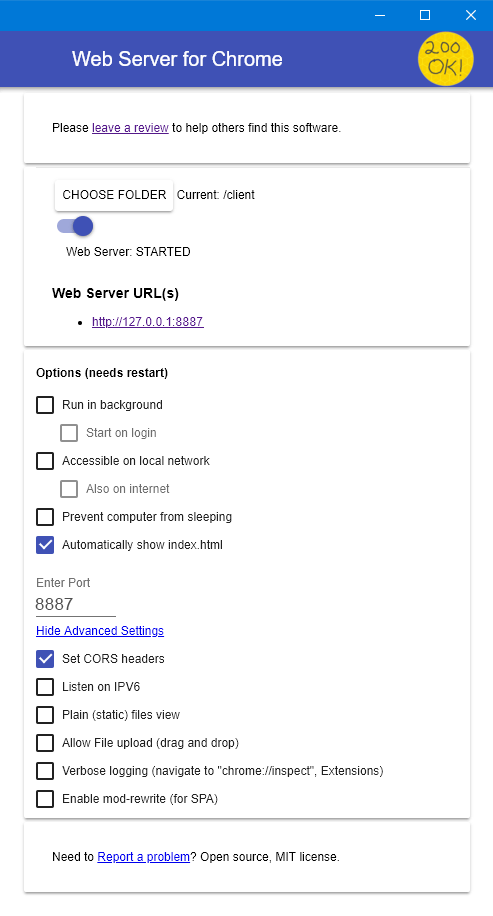

## Benodigdheden

Voordat we aan de slag kunnen, moeten we eerst een paar dingen regelen. We hebben een checklist gemaakt van alles wat je nodig hebt, daaronder volgt per stap de uitleg.

### Checklist

1. De skeleton app
2. Een tekst editor
3. Een web browser
4. Een web server
5. De chat server URL
6. De developers tools

### De skeleton app

Klik [hier](client.zip) om de skeleton app te downloaden. Pak dit bestand uit naar een map, bijvoorbeeld op je bureaublad.

Dit zijn de bestanden die je nodig hebt om te beginnen: een html file, een css file en een javascript file. Elk bestand heeft z'n eigen hoofdstuk, waarin je dat bestand gaat bewerken en je eigen dingen toe voegt.

Als je ergens een foutje maakt, kun je de bestanden altijd opnieuw uitpakken.

### Een tekst editor

Als je nog geen tekst editor hebt, adviseren wij [Visual Studio Code](www.vscode.com).

Download, installeer en open VS Code. In VS Code klik je op "Open Folder", selecteer dan de map waar je de skeleton app hebt uitgepakt.

Andere tekst editors zijn ook prima, als je aan iets anders gewend bent. Bijvoorbeeld: Notepad++ of Sublime Text.

### Een web browser

In alle voorbeelden gebruiken wij [Google Chrome](www.googlechrome.com). Andere browsers, zoals Firefox of Edge, zijn ook prima, mogelijk zien de app en developers tools er dan wel anders uit dan in Chrome.

Controleer ook of je de nieuwste versie hebt van de browser, om zeker te weten dat de app goed werkt.

### Een web server

Om je app te zien, moet je een web server hebben die naar je map verwijst. Daarnaast zijn er een paar instellingen belangrijk.

Wij adviseren [Web Server for Chrome](https://chrome.google.com/webstore/detail/web-server-for-chrome/ofhbbkphhbklhfoeikjpcbhemlocgigb). Installeer de web server en open de app. Je zie dan een instellingen pagina. Selecteer hier de uitgepakte map en stel de server in zoals op deze afbeelding:

> TODO: screenshot van de instellingen.

*Let op*: De CORS headers zijn heel belangrijk om de chat werkend te krijgen.

### De chat server URL

Als het goed is, hebben de mentoren je een link gegeven van de chat server. Dit is belangrijk om te kunnen praten met de andere ninja's in de groep.

Zoek de volgende regel in je index.html bestand, en plak de chat server url tussen de haakjes:





### De developers tools

Als het goed is, heb je nu alles om je app te bouwen. Open de link van je web server in Chrome, als het goed is zie je dan drie gekleurde balken.

Klik met je rechter muisknop op &egrave;&egrave;n van die balken en klik op "Inspect Element". Hiermee open je de developers tools van Chrome, waar je kan sleutelen aan alle onderdelen van de app.

> TODO: screenshot van knopje waarmee je de tools verticaal zet.

Voor de chat app is het fijn om de developers tools rechts van je scherm te zetten met *deze* knop, rechts van je tools. Sleep de rand van de tools dan zo, dat het ongeveer de helft van je scherm in beslag neemt.

> TODO: screenshot van de developers tools.

## Structuur

## Stijl (CSS)

## Scripts (JavaScript)


