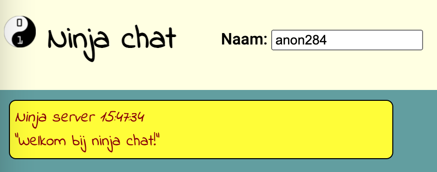
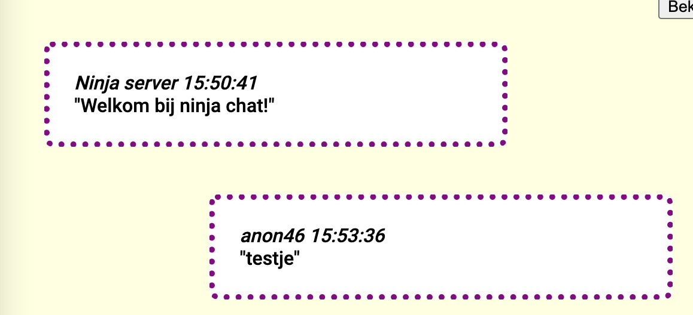

We gaan een chat programma maken!

<!--more-->

## Benodigdheden

Voordat we aan de slag kunnen, moeten we eerst een paar dingen regelen. We hebben een checklist gemaakt van alles wat je nodig hebt, daaronder volgt per stap de uitleg.

### Checklist

1. De skeleton app
2. Een tekst editor
3. Een web browser
4. Een web server
5. De chat server URL
6. De developers tools

### De skeleton app

Klik [hier](client.zip) om de skeleton app te downloaden. Pak dit bestand uit naar een map, bijvoorbeeld op je bureaublad.

Dit zijn de bestanden die je nodig hebt om te beginnen: een html file, een css file en een javascript file. Elk bestand heeft z'n eigen hoofdstuk, waarin je dat bestand gaat bewerken en je eigen dingen toe voegt.

Als je ergens een foutje maakt, kun je de bestanden altijd opnieuw uitpakken.

### Een tekst editor

Als je nog geen tekst editor hebt, adviseren wij [Visual Studio Code](www.vscode.com).

Download, installeer en open VS Code. In VS Code klik je op "Open Folder", selecteer dan de map waar je de skeleton app hebt uitgepakt.

Andere tekst editors zijn ook prima, als je aan iets anders gewend bent. Bijvoorbeeld: Notepad++ of Sublime Text.

### Een web browser

In alle voorbeelden gebruiken wij [Google Chrome](www.googlechrome.com). Andere browsers, zoals Firefox of Edge, zijn ook prima, mogelijk zien de app en developers tools er dan wel anders uit dan in Chrome.

Controleer ook of je de nieuwste versie hebt van de browser, om zeker te weten dat de app goed werkt.

### Een web server

Om je app te zien, moet je een web server hebben die naar je map verwijst. Daarnaast zijn er een paar instellingen belangrijk.

Wij adviseren [Web Server for Chrome](https://chrome.google.com/webstore/detail/web-server-for-chrome/ofhbbkphhbklhfoeikjpcbhemlocgigb). Installeer de web server en open de app. Je zie dan een instellingen pagina. Selecteer hier de uitgepakte map en stel de server in zoals op deze afbeelding:

*Let op*: De CORS headers zijn heel belangrijk om de chat werkend te krijgen.

### De chat server URL

Als het goed is, hebben de mentoren je een link gegeven van de chat server. Dit is belangrijk om te kunnen praten met de andere ninja's in de groep.

Zoek de volgende regel in je index.html bestand, en plak de chat server url tussen de haakjes:





### De developers tools

Als het goed is, heb je nu alles om je app te bouwen. Open de link van je web server in Chrome, als het goed is zie je dan drie gekleurde balken.

Klik met je rechter muisknop op &egrave;&egrave;n van die balken en klik op "Inspect Element". Hiermee open je de developers tools van Chrome, waar je kan sleutelen aan alle onderdelen van de app.

Voor de chat app is het fijn om de developers tools rechts van je scherm te zetten met *deze* knop, rechts van je tools. Sleep de rand van de tools dan zo, dat het ongeveer de helft van je scherm in beslag neemt.

## Structuur (HTML)

Deze instructies bestaan uit drie hoofdstukken:
1. Structuur (HTML) - hier gaan we de app onderdelen in elkaar zetten.
2. Stijl (CSS) - hier gaan we veranderen hoe de onderdelen eruit zien.
3. Scripts (Javascript) - hier gaan we veranderen hoe de app werkt.

Bij elk hoofdstuk hoort een bestand. Voor dit hoofdstuk werken we in de *index.html*.

### HTML: blokjes en tekst

In het begin zul je nog niet alles snappen wat in de bestanden staat. Dat is ok&egrave;! Laten we eerst rond kijken en dan gaan we onze eigen onderdelen toevoegen:

- Open de app en de developers tools (zie [Benodigdheden]((#benodigdheden))).
- Klik op de Inspect Element knop (zie afbeelding), zodat deze blauw wordt.   

- Beweeg de muis over de groene, gele en grijze balken in de app.

Je ziet de 'div' elementen in de Developers Tools oplichten. Dat zijn de 'blokjes' waarmee je begint. Een paar dingen moet je weten over die blokjes:

- Een blok begint met **\<div\>** en eindigt met **\</div\>**.
- Met **class=""** krijgt het blokje een class naam.
- De class wordt in de CSS (hoofdstuk 2) gebruikt om te bepalen hoe het eruit ziet.
- De class wordt ook in de Javascript (hoofdstuk 3) gebruikt om te bepalen hoe het werkt.
- Blokjes kunnen *in* elkaar en blokjes kunnen *naast* elkaar.

#### HTML tekst

In de HTML kun je tekst typen. Afhankelijk van waar je die tekst typt, komt het ergens anders op het scherm (of misschien zelfs helemaal niet).

- Zoek de div blokjes op in de index.html, het zijn er vier.
- De 'container' class zorgt ervoor dat de blokjes die er in zitten onder elkaar komen.
- In de container zie je drie andere divs. Kun je raden waar die voor zijn?
- Schrijf wat tekst, bijvoorbeeld "Hallo wereld!", in het blokje met de class 'midden'.
- Ververs je pagina. Staat je tekst in het middelste blokje? Zo niet, dan is er misschien iets mis gegaan.
- Probeer ook tekst te typen in de boven en onder blokjes. Verschijnt die tekst ook op de juiste plek in je scherm?
- Wat gebeurt er als je tekst typt in de container, maar *buiten* de boven/midden/onder blokjes?
- Wat gebeurt er als je tekst typt *buiten* de container (maar wel in de **\<body\>**)?

### Chat berichten

Nu dat je snapt hoe de HTML blokjes werken, kun je je eigen blokjes toe voegen.  
Voeg deze code in, in het blokje *"midden"*:





Ververs de pagina. Als het goed is, verschijnen nu de chat berichten op je scherm! Zo makkelijk kan het zijn om onderdelen toe te voegen.

#### Berichten typen

We willen natuurlijk ook berichten kunnen sturen.  
Voeg deze code in, in het blokje *"onder"*:



Type hier...



Als het goed is, zie je *"Type hier..."* op je scherm, maar als je daar klikt, kun je nog niet typen. Dat komt, omdat *div* daar niet voor is gemaakt. Verander het woord *div* in *textarea*, en ineens ziet het er heel anders uit:


<textarea class="berichtInput" placeholder="Type hier..."></textarea>


Je kunt nu tekst typen. Als je op enter drukt, wordt je bericht verstuurd!

### Meer onderdelen

Laten we nog wat meer onderdelen toevoegen. Kopieer deze blokjes en plak ze in de boven/midden/onder blokjes. Je mag zelf bepalen waar deze blokjes in je app komen en in welke volgorde. Je kan ook ons voorbeeld onderin deze pagina na maken.

**Tips:**
- Probeer niet alles tegelijk te doen. Plak een blokje in de index.html, sla op en ververs de pagina in chrome.
- Staat een blokje niet op de plek die je had verwacht? Gebruik de Inspect Element knop om te ontdekken wat er mis is gegaan!
- De boven/midden/onder classes heb elk hun eigen manier van blokjes plaatsen. Hier gaan we in het volgende hoofdstuk verder op in.
- Verander teksten en de type blokjes, je kan er vanalles van maken. Zolang de 'class' klopt, zou het moeten blijven werken.

#### De blokjes


<h1>Ninja chat</h1>


Met h1 plaats je een titel, de letters zijn dan groter en dikker. Het heeft verder geen speciale effecten, dus h1 is net als een div. Probeer ook h2 en h3 voor verschillende grooottes.



Naam: <input type="text" class="naamInput">



Een input is een speciaal soort blokje, waar je iets kan typen of aanklikken. Een input hoeft niet afgesloten te worden, want er kan nooit html *in* een input staan. Met *type="text"* wordt gezegd dat je tekst kan typen. De class *'naamInput'* is voor het invoeren van je naam. We hebben de input in een div blokje geplaatst, zodat de tekst "Naam" er mooi bij komt te staan. Verander de standaard naam in je eigen naam, omdat bij de berichten terug te zien.



Kanaal: <input type="number" class="kanaalInput">



Ook dit is een input, nu met type *'number'*, zodat je alleen een getal kan invullen. Elk bericht hoort bij een kanaal en je kanaal is standaard '1'.


<button class="stuurBericht">Stuur bericht</button>


Button is Engels voor het woord 'knop'. Tot nu toe stuurde je berichten door op 'enter' te drukken, nu kan het ook door op deze knop te klikken.





Deze div is nog leeg, het doet niets totdat er op de deelnemers knop wordt gedrukt. Maar die knop heb je nog niet, dus die volgt nu:


<button class="bekijkDeelnemers">Bekijk deelnemers</button>


Je krijgt dus een knop waarmee je deelnemers kan bekijken, zodra daar op wordt geklikt wordt de 'deelnemers' div gevuld met de namen van de andere ninja's en mentoren. Deze knop mag ook *in* de 'deelnemers' div staan, zodat de namen en de knop mooi bij elkaar staan.

### HTML in berichten

Wat de ninja-chat zo bijzonder maakt, is dat je HTML in je berichten kan gebruiken. Type maar eens als bericht in de chat:


<h1>Hallo wereld!<h1>


Zoals eerder gezegd, is h1 een blokje zoals de div. Maar niet elke HTML code is een eigen blokje. Je kan ook HTML gebruiken om een woord of meerdere woorden op te maken. Type dit als bericht in de chat:

Hier is woord \<strong\>dikgedrukt\</strong\> en twee woorden \<em\>schuin gedrukt\</em\>!

Probeer ook andere HTML code die je hebt geleerd in je berichten. Alles mag!

### Afbeeldingen

Het mooiste HTML blokje hebben we bewaard voor het laatst: je kan plaatjes zien in je app!





Het plaatje is erg groot, eigenlijk te groot om mooi in de app te passen. Dit is makkelijk op te lossen door een width (= breedte) en een height (= hoogte) bij te voegen:





Net als een input blokje, hoeft de img niet afgesloten te worden. De link voor het plaatje schrijf je in *src=""*. We gebruiken nu de bijgesloten coderdojo.png als voorbeeld, maar het kan elk plaatje zijn wat je maar wilt.

Zo kies je je eigen plaatjes:

- Zoek op internet een plaatje dat je in de app wilt hebben.
- Klik met rechtermuisknop op het plaatje en selecteer *"afbeeldingsadres kopi&euml;ren"*.
- Type een nieuw *img* blok in je index.html en ze je cursor in de aanhalingstekens van de *src*.
- Gebruik rechtermuisknop en klik op plakken, of type CTRL-V om te plakken.
- Sla op en bekijk je plaatje in de app.

*Tip:* Op deze manier kun je ook plaatjes in je chat berichten plaatsen.

## Stijl (CSS)

Je weet nu hoe je HTML blokjes kan plaatsen en je weet hoe je die een class naam kan geven. Die class namen gaan we nu gebruiken om ze te *stylen*: je kan helemaal veranderen hoe ze eruit zien!

Voor dit hoofdstuk werk je voornamelijk in het bestand *basic-chat.css*.

### Kleuren en lettertypes

Laten we eerst kleuren aanpassen:

- Zoek het div blokje 'midden' in de Developers Tools, gebruik eventueel Inspect Element op de gele achtergrond.
- Rechts zie je een tabblad *"Styles"*, hier staan alle CSS regels voor dit blokje. Schrik niet, het zijn er veel!
- Zoek de regel *background-color: lightyellow* (TODO: screenshot met een pijl ofzo).
- Klik op het woord *lightyellow* en druk op backspace.
- De browser toont al een lijst van kleuren, klik of type *cadetblue*.
- Zie hoe de kleur van het midden blok is veranderd!
- Verander van andere blokjes ook de background-color. Probeer verschillende kleuren uit.

De kleuren die je nu in stelt worden nog niet opgeslagen. De volgende keer dat je refresht is alles weer terug naar hoe het was.

#### Styling opslaan

Dit is hoe je je kleuren kan opslaan:

- Noteer of kopieer de naam van de kleur die je wilt opslaan.
- Je kunt ook een kleur kiezen op deze website: [csscolornames.com](http://csscolornames.com/)
- Open de *basic-chat.css*.
- Zoek de regel *.midden {*, hier staan de stijl regels voor het midden blok.
- Verander de background-color in een kleur naar keuze en sla het bestand op.
- Refresh je browser en zie de kleur die je hebt gekozen in het midden blok.

Op deze manier kun je alle achtergrond kleuren instellen die je wilt. Zoek de andere onderdelen van je app op in het CSS bestand en geef ze een kleur die je leuk vindt.

#### Tekst

Je kunt ook teksten er anders uit laten zien. Voeg deze regels eens toe, bijvoorbeeld bij .bericht:


    color: yellow;  
    font-family: 'Indie Flower', cursive;


*color* verandert de kleur van de tekst. Je kunt dezelfde kleuren gebruiken als voor *background-color*.  
*font-family* verandert het lettertype. Kun je ontdekken welk lettertype nog meer wordt gebruikt in de app?

Probeer deze kleuren eens na te maken. *Tip:* Geef de titel een nieuwe class naam en gebruik die class naam om in de CSS het lettertype in te stellen.

### Vormen en randen

Alles op het scherm kunnen we groter of kleiner maken. Probeer dit eens uit:

 - Klik op één van de berichten, met Inspect Element.
 - Bij de styles zie je onder andere padding, border en margin.
 - Verander de getallen één voor één en kijk wat er gebeurt: maak ze 40px, of 1px, of 0.
 - Je ziet ook border-radius, verander daarvan ook het getal.
 - Verander de kleur van 'border' (border is Engels voor 'rand').
 - Verander bij de border het woord 'solid' in 'dotted' en kijk wat er gebeurt.

Het is makkelijker om te zien wat het doet, dan om het uit te leggen. In het kort:

 - *10px* betekent 10 pixels. Een pixels is een punt op je scherm.
 - *border* is de rand van een blokje. Het is een lijn of stippels, heeft een kleur en een dikte.
 - *padding* is hoeveel ruimte er IN het blokje is, voordat de tekst begint.
 - *margin* is hoeveel ruimte er OM het blokje heen is.
 - *border-radius* is om te rand rond te maken.

*Tip:* Probeer eens een blokje helemaal rond te maken met border-radius.

### Meer CSS

Met CSS kun je van elk blokje zeggen hoe het eruit moet zien. Als je het leuk vindt, kun je in de basic-chat.css nog andere blokjes aanpassen met de border en padding enzo. Je kunt ook kijken welke CSS opdrachten er nog meer in staan. We hebben zoveel mogelijk in het bestand beschreven wat we doen, als je twijfelt kun je altijd nog op internet zoeken. Succes!

### Styling in berichten

Je kunt ook CSS in je berichten gebruiken! Schrijf bijvoorbeeld eens:


Hier is een stukje tekst blauw


Met *style=""* kun je CSS in een HTML blokje stoppen. Dat werkt dan alleen voor dat ene blokje, maar dat is perfect voor in berichten. Probeer ook eens de andere CSS commando's die je hebt geleerd, zoals border en font-family.

*Tip:* als je meerdere CSS commando's in één blokje wilt, zet je er een ; tussen. Bijvoorbeeld:


Dit bericht is zwart/wit.


## Scripts (JavaScript)

Nu dat je een complete app hebt en zelf heb bepaald hoe het eruit ziet, gaan we een kijkje onder de motorkap nemen: hoe worden de berichten verstuurd en ontvangen?  
Voor dit hoofdstuk werk je in het bestand *basic-chat.js*.

### Javascript: de basis

Javascript is de programmeertaal van het web. Alle HTML blokjes die je nu in je app hebt, kun je met Javascript aan sturen. Je kunt ook berichten sturen naar de server en ontvangen van de server. Daar gaan we mee aan de slag.

 - Klik bovenin de Developers Tools op het tabblad "Console".
 - Je ziet een groot vlak en misschien een paar berichten. Onder de berichten, zie je een blauwe *>*, klik daar naast zodat je kan typen.
 - Type de onderstaande berichten. Druk na elk bericht op enter en zie wat er gebeurt:


console.log("Hallo console!")
socket.emit("maakBericht", "Hallo websocket!")


Je hebt nu een berichtje in de console én je hebt een berichtje via de chat verstuurd! Allebei kunnen ze heel handig zijn! Laten we zien wat we nog meer kunnen met Javascript.  
Als je iets wilt weten van je app, kun je een commando geven dat iets terug geeft om te onthouden. Type eens:


$(".naamInput").val()


Je ziet je naam nu terug in de console! Deze commando ziet er misschien gek uit, dit is wat er gebeurt:

 - *$(".naamInput")* zoekt de blokjes op met de class 'naamInput'.
 - *.val()* vraagt om de tekst die staat ingevuld bij het eerst gevonden blokje.

Kun je op die manier ook het kanaal op vragen? Of een bericht in de chat?

### Variabelen

Met variabelen (var) kan de browser dingen onthouden:


var naam = $(".naamInput").val()
socket.emit("maakBericht", "Hallo, mijn naam is " + naam)


Je hebt nu een bericht verstuurd met je naam er in! Kun je hetzelfde doen met je kanaal?

#### Berekeningen

Computers zijn ook heel goed in rekenen. Het woord computer is zelfs Engels voor "berekenaar"! Type het volgende maar eens om uit te proberen:


var kanaal = $(".kanaalInput").val()
kanaal + 2


Dit gaat nog niet goed: het getal 2 is achter het kanaal nummer geplaatst. Dat komt omdat javascript niet gelijk snapt dat het een getal is:


parseInt(kanaal) + 2


Nu zie je je kanaal, met twee erbij opgeteld. Om de oefening af te maken, laten we de server vertellen dat we een nieuw kanaal willen:


socket.emit("zetKanaal", parseInt(kanaal) + 2)


### Functies en parameters

Je hebt al verschillende commando's aangeroepen, zoals socket.emit en parseInt, maar je kan ook je eigen commando's maken. Dat noemen we *functions*. Type dit eens in je console:


function hallo(naam) {
    socket.emit("maakBericht", "Hallo " + naam + "!")
}


Er gebeurt nog niets. Dat komt omdat je de function eerst moet aanroepen, voordat er iets gebeurt:


hallo("ninjas")
hallo("ikzelf")
hallo("javascript")


Je kan de functie zo vaak aanroepen als je maar wilt.

### Je eigen bot

Je weet nu al veel over hoe je commando's geeft en maakt in Javascript. Met functions kun je ook reageren op dingen die gebeuren. Zo kun je een function schrijven die reageert op berichten in de chat:


function hoiDoei(bericht) {
    if (bericht.tekst == "hoi") {
        socket.emit("maakBericht", "doei")
    }
}


Het woord *if* is Engels voor 'als'. Er staat dus: *als* het bericht "hoi" is, zeg dan "doei". Maar hoe ontvangen we berichten?


socket.on("krijgBericht", hoiDoei)


Elke keer als er een bericht binnen komt, wordt de commando hoiDoei aangeroepen. Type maar eens het woord "hoi" in de chat!

### Nog veel meer

Met HTML, CSS en Javascript kun je hele programma's bouwen, zoals je ziet. Er valt nog ontzettend veel te leren! De eerst volgende stap is om de *basic-chat.js* te lezen en je kan dat bestand ook aanpassen, om andere dingen te doen: automatisch van kanaal wisselen bij een bericht, je naam veranderen via een bericht, enzovoorts. Je kunt ook altijd op internet zoeken naar wat je nog meer kan met HTML, CSS en Javascript, de website https://www.w3schools.com/ is een leuke plek om te beginnen. Heel veel plezier en heel veel succes!


